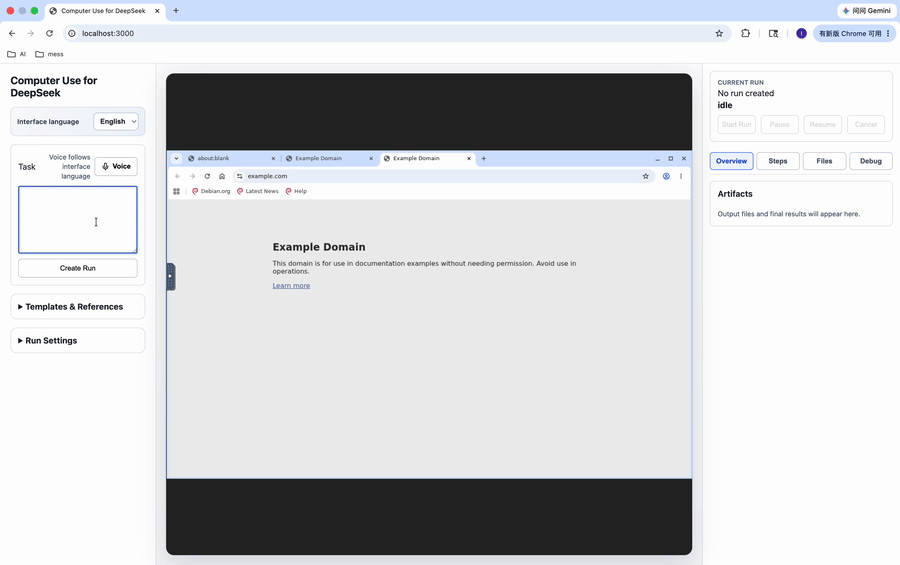
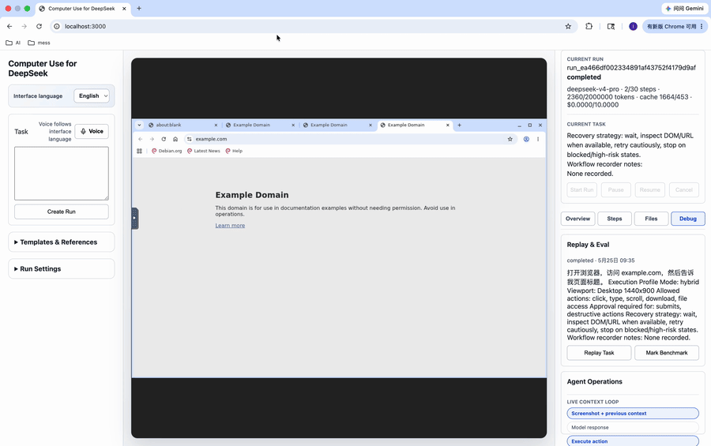

# Computer Use for DeepSeek

[中文文档](./README.zh-CN.md)

Computer Use for DeepSeek is a local web app that lets DeepSeek operate a sandboxed computer through a browser interface. You enter a task, watch the remote desktop, upload files when needed, and download results when the task is finished.

The app runs locally. Your files stay in the local workspace you provide or upload, and the AI works inside an isolated computer environment.

## Relationship to Claude Computer Use

This project is inspired by Claude Computer Use from Anthropic. It follows the same core idea: an AI model observes a sandboxed computer, requests mouse/keyboard actions, and receives screenshots or tool results in a loop.

Computer Use for DeepSeek is an independent project for DeepSeek models. It is not an Anthropic or Claude product, and it does not use Claude Computer Use APIs. The goal is to provide a similar computer-use experience using DeepSeek as the model backend.

## Demos

These demos are captured from the local acceptance flow. They show the product Web UI that users interact with, plus the sandbox desktop where the AI performs visible computer actions.

### Browser Task

Create a run, ask DeepSeek to open `example.com`, and have it report the page title. The UI shows run state, timeline events, usage, and the remote desktop while the task is running.



### Workspace File Task

Upload a local file, ask the AI to rewrite it, and download the generated `output.txt` from the workspace. The user only works through the Web UI; the isolated runtime handles file operations inside the task workspace.



## What You Need

- A DeepSeek API key
- Docker Desktop or Docker Engine
- A modern browser, such as Chrome, Edge, Firefox, or Safari
- Internet access for DeepSeek API calls

Docker is required by the app, but you do not need to operate Docker directly during normal use.
On normal startup, the app uses prebuilt server, web, and sandbox runtime images. It should not install Python or Node dependencies, or build Chromium and desktop packages, on your machine.

## Setup

Create your local config:

```bash
cp .env.example .env
```

Open `.env` and set:

```bash
DEEPSEEK_API_KEY=your_api_key_here
```

The other settings have defaults and usually do not need to be changed.

## Start the App

Run:

```bash
./start.sh
```

The startup script pulls the latest published images before starting services, so you get the newest shipped UI on each run.
It also recreates the Compose containers so they actually run the newly pulled images.

After you see `Backend API is ready.`, open:

```text
http://localhost:3000
```

The startup script checks your config, starts the local services, and waits for the backend API to be ready. If something is missing, or if the backend cannot start in time, it will tell you what to fix.

If you are developing the app itself and want source-code hot reload, use the development compose override:

```bash
docker compose -f docker-compose.yml -f docker-compose.dev.yml up -d
```

Most users do not need this command.

To smoke-test the runtime after publishing or building an image:

```bash
./scripts/smoke-runtime.sh
```

For a local development image, run:

```bash
./scripts/smoke-runtime.sh --dev-build
```

## Using Files

Use the web app to upload files into a task workspace. The AI can read and edit files in that workspace, then you can download the generated results from the same web interface.

For safety, the app does not mount your entire home directory by default.

## Run History

After you create a task, the current run panel keeps showing the task text while the run executes. The sidebar also keeps a run history with the run ID, task, status, time, and final result when available. History is stored under the local `data/` directory used by `./start.sh`, so it remains available after restarting the app.

## Voice Input

The Web UI supports a persistent browser voice mode for the task box and a small set of task-control commands. Turn on `Voice`, allow microphone access, choose the recognition language, and speak naturally. The app keeps listening while voice mode is on, uses the transcript to separate task text from UI actions, and speaks back what it understood or what it needs clarified. You can say things like `打开浏览器，访问 baidu.com，开始运行` or `create run`, `start run`, `pause`, `resume`, `cancel`, and `clear input`.

Voice control only uses the existing Web UI actions. It can create a run, start the current run, pause, resume, cancel, or clear the task box, but it cannot approve or reject pending confirmations by voice, and it cannot control the sandbox runtime directly. Chrome and Edge provide the best browser support.

## Common Settings

Most users only need `DEEPSEEK_API_KEY`.

Optional settings:

```bash
DEEPSEEK_MODEL=deepseek-v4-pro
DEEPSEEK_FAST_MODEL=deepseek-v4-flash
DEEPSEEK_PRO_MODEL=deepseek-v4-pro
DEEPSEEK_ROUTING=quality_first
APP_MAX_STEPS=30
APP_TOKEN_BUDGET=2000000
APP_COST_BUDGET_USD=0
DEEPSEEK_INPUT_USD_PER_MTOK=0
DEEPSEEK_OUTPUT_USD_PER_MTOK=0
VOICE_INPUT_ENABLED=true
VOICE_PROVIDER=browser
APP_RUNTIME_MODE=docker
RUNTIME_IMAGE=ghcr.io/pony-maggie/computer-use-for-deepseek-runtime:latest
```

Use `deepseek-v4-pro` for higher-quality runs. Set `DEEPSEEK_ROUTING=cost_first` to route simpler tasks to `DEEPSEEK_FAST_MODEL` and complex tasks to `DEEPSEEK_PRO_MODEL`.
Use a smaller max step limit or token budget if you want stricter time and usage control. Set `APP_COST_BUDGET_USD` together with the per-million-token price fields if you want the app to stop a run when estimated API cost crosses your budget.
The UI also shows DeepSeek prompt cache hit/miss tokens when the API returns them, which helps you understand whether stable prompt caching is reducing cost.

While the GitHub repository is private, the runtime package may also be private. In that case, sign in before starting:

```bash
docker login ghcr.io
```

## Safety Notes

- Review sensitive actions before approving them.
- Do not upload files that the AI does not need for the task.
- Use a dedicated workspace for each task.
- Avoid asking the AI to handle payments, legal agreements, or irreversible account actions without human review.

## Stop the App

Run:

```bash
./stop.sh
```

Packaged versions may provide a Stop button or a one-click menu action.

## Troubleshooting

If the app does not start:

- Confirm Docker is running.
- Confirm `.env` exists.
- Confirm `DEEPSEEK_API_KEY` is set.
- Check that ports `3000`, `8000`, and `6080` are available.

If a task gets stuck, stop the run in the web app and start a new one with a more specific instruction.
